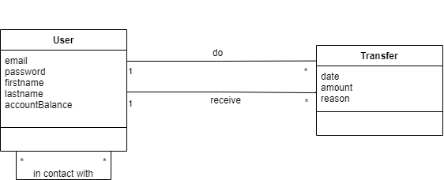
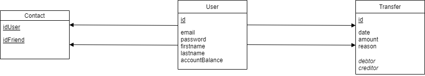

# **ReadMe** 

## - **Pay My Buddy Application** 

An app to transfer money easily .  
This app uses Java to run.

## - **Getting Started**

These instructions will get you a copy of the project up and running on your local machine for development and testing purposes. 

## - **Prerequisites**

You need to install : 
* Java 17
* Maven 3.8.7
* MySQL 8.0.31

## - **Installing** 

* [Install Java](https://docs.oracle.com/javase/8/docs/technotes/guides/install/install_overview.html)
* [Install Maven](https://maven.apache.org/install.html)
* [Install MySQL](https://dev.mysql.com/downloads/mysql/)

After downloading the mysql 8 installer and installing it, you will be asked to configure the password for the default root account.

### Reference Documentation
For further reference, please consider the following sections:

* [Official Apache Maven documentation](https://maven.apache.org/guides/index.html)
* [Spring Boot Maven Plugin Reference Guide](https://docs.spring.io/spring-boot/docs/3.0.2/maven-plugin/reference/html/)
* [Create an OCI image](https://docs.spring.io/spring-boot/docs/3.0.2/maven-plugin/reference/html/#build-image)
* [Spring Web](https://docs.spring.io/spring-boot/docs/3.0.2/reference/htmlsingle/#web)

### Guides
The following guides illustrate how to use some features concretely:

* [Handling Form Submission](https://spring.io/guides/gs/handling-form-submission/)
* [Serving Web Content with Spring MVC](https://spring.io/guides/gs/serving-web-content/)

## - **Running App** 

Post installation of MySQL, Java and Maven, you will have to set up the tables and data in the database. 
For this, please run the sql commands present in the *DatabaseCreation.sql* and *Data.sql* files under the *resources* folder in the code base.

Import the code on your computer.

To run the app, go to the folder that contains the pom.xml file and execute the following command in which you have to replace "*%username%*" by your username and "%*password*%" by your password required to access your database : 
 "mvn spring-boot:run "-Dspring-boot.run.arguments=--spring.datasource.username=%username% --spring.datasource.password=%password%"

You can access the app in a browser at this address : http://localhost:8080/index.  

NB : the passwords of all users in database are "1234".

## - **UML Class Diagram**

## - **Physical Data Model**

## - **Testing**

The app has unit tests and integration tests written.  
To run the tests from maven, go to the folder that contains the pom.xml file and execute the following command : *mvn test*.  
To get both Surefire Report and Jacoco Report in Maven Site, you can execute the command mvn site and open the file « *index.html* » in the folder « *./target/site* ».  
JaCoCo and Surefire reports are in the section « *Project Reports* ».
